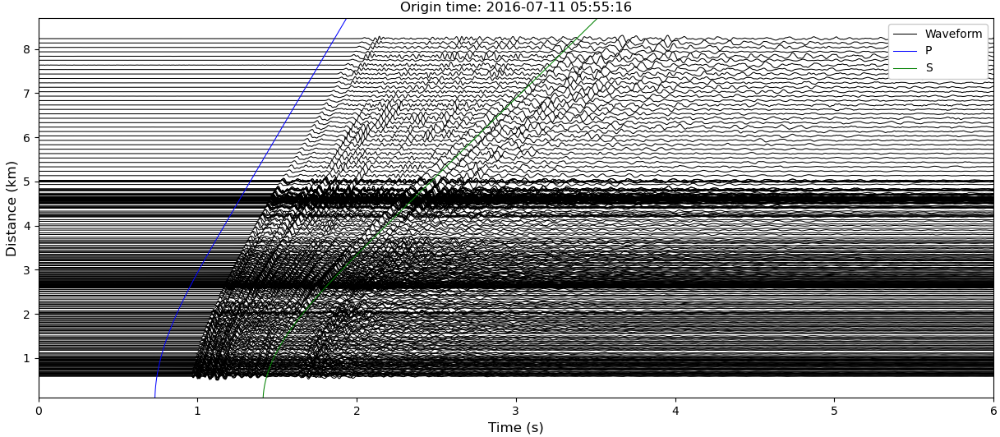

# Welcome to SeisScan's documentation!

<!--  -->


**SeisScan** is an open source Python package to detect and locate microearthquakes. This package adopts the method developed in the article [Roy et al., (2024)](#citing). The method leverages the signal coherence across clusters of seismic stations to generate characteristic functions that are backprojected (migrated) to detect and locate seismic events.

For a tutorial on how to use the package, please refer to the documentation available on the website (ReadTheDocs).

## Installation

SeisScan is currently running on Mac OS. SeisScan runs on Python 3.10 and up. We recommend you use the latest version of python 3 if possible.

### Install via Pip

```bash
$ pip install seisscan
```

### Install via Anaconda

```bash
$ conda create -n env_seis python=3.10
$ conda activate env_seis
$ conda -c conda-forge obspy=1.4.0 pandas=2.2.2 numpy=1.26.4 utm=0.7.0 dask=2024.8.0 distributed=2024.8.0 jupyter=1.0.0
$ conda install -c ksr22 seisscan
```

## Usage

```python
from obspy import UTCDateTime
import seisscan as ss

# Read example data
event_dict, st, inventory, subnetworks, model_name = ss.read_example()

# Extract event information
evt0 = UTCDateTime(event_dict["evt0"])    # event origin time
evlo = event_dict["evlo"]                 # event longitude
evla = event_dict["evla"]                 # event latitude
evdp = event_dict["evdp"]                 # event depth (km)

# Plot record section
fig = ss.prs(st.select(channel="DPZ"),
             evt0, evlo, evla, evdp, scale=0.1, model_name=model_name,
             xmin=0.0, xmax=6.0, width=15, height=6, handle=True)
```



-----------------------------

## License

`SeisScan` is licensed under the terms of the MIT license.

-----------------------------

## Author

Ketan Singha Roy  
PhD Student  
Department of Earth Sciences  
Southern Methodist University  
Dallas, Texas, USA

Email: [ksingharoy@smu.edu](mailto:ksingharoy@smu.edu), [ketansingharoy@gmail.com](mailto:ketansingharoy@gmail.com)

-----------------------------

## Citing
If you make use of this code in published work, please cite:

Ketan Singha Roy, Stephen Arrowsmith, Brian Stump, Chris Hayward, Junghyun Park; Exploiting Signal Coherence to Simultaneously Detect and Locate Earthquakes. Seismological Research Letters 2024; doi: [https://doi.org/10.1785/0220240089](https://doi.org/10.1785/0220240089)

-----------------------------
-----------------------------