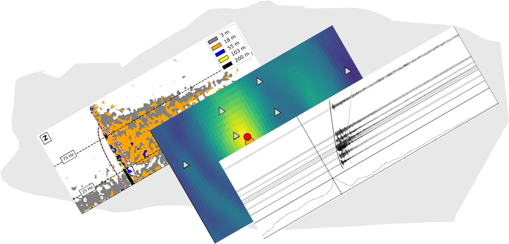

.. SeisScan documentation master file
.. include:readme.rst

====================================
Welcome to SeisScan's documentation!
====================================
.. image:: seisscan_images/SMU_logo.png
    :width: 100

About
^^^^^
**SeisScan** is an open source Python package to detect and locate microearthquakes. This package adopts the method developed in the article :ref:`Roy et al., (2024) <ksr_2024>`. The method leverages the signal coherence across clusters of seismic stations to generate characteristic functions that are backprojected (migrated) to detect and locate seismic events. The following table of content contains information to install and use the package.

.. note::

   This project is under active development.

.. toctree::
   :maxdepth: 1
   :caption: Contents:

   getting_started
   installation
   data_structure
   example
   api
   

Citing
------
If you make use of this code in published work, please cite:
    
.. _ksr_2024:

    Ketan Singha Roy, Stephen Arrowsmith, Brian Stump, Chris Hayward, Junghyun Park; Exploiting Signal Coherence to Simultaneously Detect and Locate Earthquakes. Seismological Research Letters 2024; `doi: https://doi.org/10.1785/0220240089 <https://doi.org/10.1785/0220240089>`_

License
-------
`SeisScan` is licensed under the terms of the MIT license.

Author:
-------
| Ketan Singha Roy
| PhD Student
| Department of Earth Sciences
| Southern Methodist University
| Dallas, Texas, USA
| Email: `ksingharoy@smu.edu <ksingharoy@smu.edu>`_, `ketansingharoy@gmail.com <mailto:ketansingharoy@gmail.com>`_