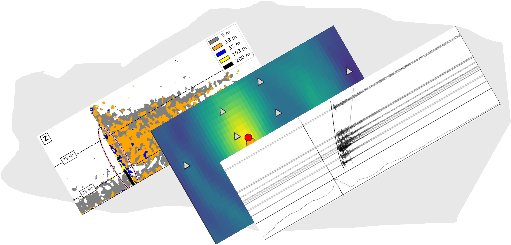

====================================
Welcome to SeisScan's documentation!
====================================
.. image:: seisscan_images/SMU_logo.png
    :width: 100

About
^^^^^
SeisScan is an open source Python package to detect and locate microearthquakes. This package adopts the method developed in the article Roy et al (2024). The method leverages the signal coherence across clusters of seismic stations to generate characteristic functions that are backprojected (migrated) to detect and locate seismic events. The following table of content contains information to install and use the package.

.. note::

   This project is under active development.

